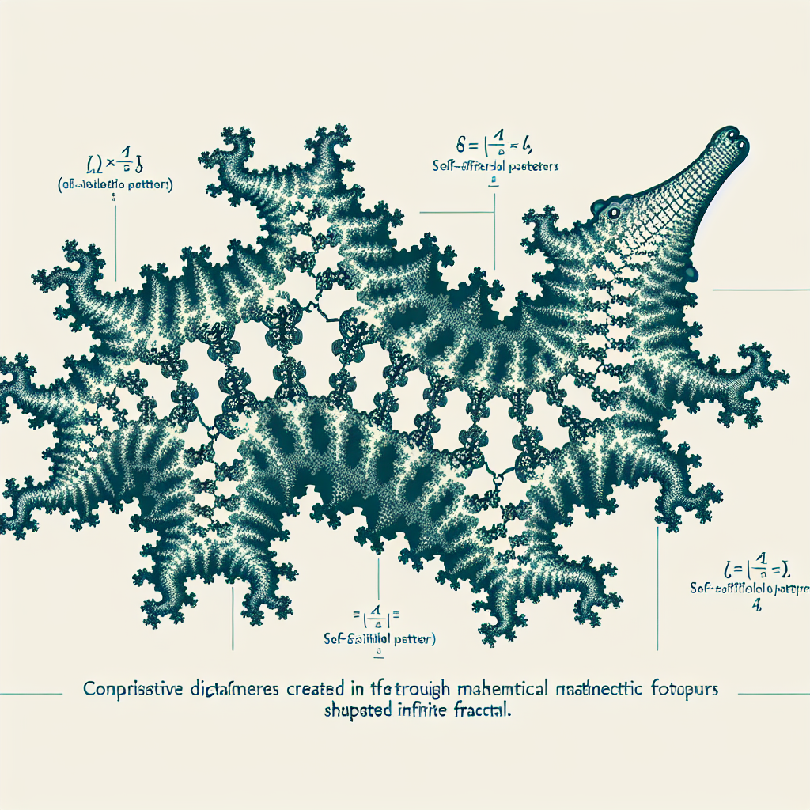

A playful twist on the word "aggregator" by repeating the "gator" sound, this pun could humorously refer to something that collects or aggregates alligators (or perhaps alligator-related items or information).